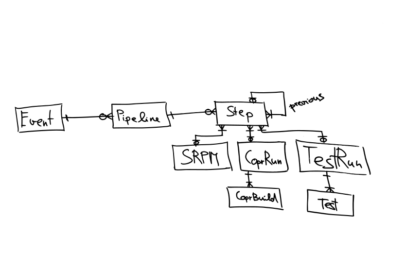
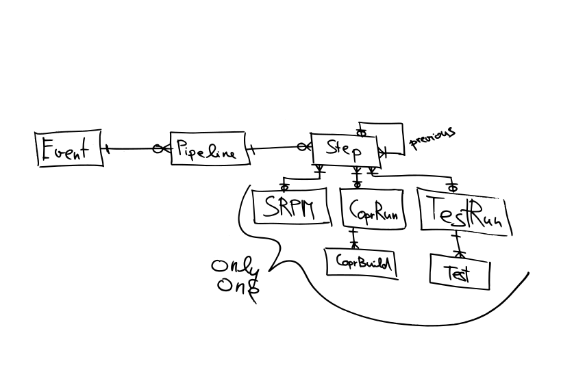
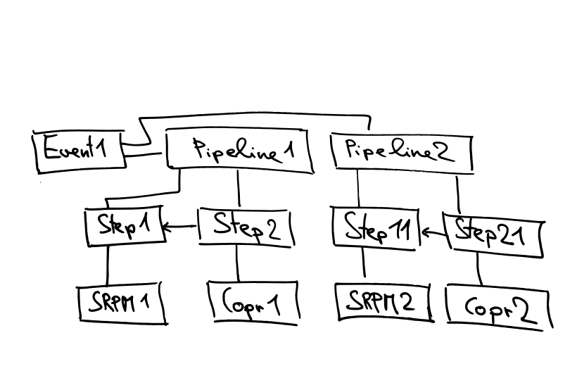

## Usecases

1. Show the whole workflow to the user.

   - It's not clear what it is.

2. For each step, we get:

   - previous step
   - next steps
   - other steps from this group (e.g. other chroots for this build)

3. It is possible to rerun the whole workflow.
4. It is possible to rerun one step (and all the follow-up steps).
5. It is possible to rerun a part of one step (and the follow-up step(s)).

   - E.g. one chroot.

6. For project, we get all workflows.
7. For project, we get all events.
8. For event, we get all workflows.
9. For event, we get a project.
10. For each step, we get event.
11. For each step, we get project.

## How to deal with chroots?

Have a grouping model for all chroots that are related. In Copr, all the chroots are build together and we can group those builds together, but where the grouping does not exists, we can do it manually (=implement the logic on our side).

## How to do pipelines?

We can create a new `Step` model that will be a middle point between `Pipeline` and build/test model. The `Step` model can also track the relation to other `Steps`. One test/build can be connected to multiple `Steps`:

- No `n:m` mapping between `Pipeline` and test/build model is needed.
- Sharing of test/build is possible if we retrigger part of the workflow.

We just need to make sure that there is only one build/test item linked to one `Step`:

Here are the queries we need to do:

The following two images show the `Pipeline` from the object point of view.

The whole pipeline retriggered:

Only build retriggered:

### Check-runs UX

Currently, user can request a rerun for a single chroot using the `retry` button. With that, there will be a new pipeline for each chroot we re-trigger. To be able to group all the retried chroots, we can create a [so-called requested action](https://docs.github.com/en/rest/guides/getting-started-with-the-checks-api#check-runs-and-requested-actions) to re-trigger all or all failed. We can also provide choise of the step to re-trigger.

## Effectiveness of the queries

For the regular queries covering multiple entries that goes across the database, it might be better to create them as one query and not relly on the ORM.

### Migrations

- For the model that groups the Copr chroots together, we need to group them by `copr_id` or `SRPMBuildModel`.
- For the model that groups the Koji chroots together, we need to group them by `SRPMBuildModel`.
  (There is no connection on the Koji level.) For the future, we need to do this ourselves.
- In case of `TF`, `SRPMBuildModel` is probably the only way, but this doesn't cover the test retrigger and test-only scenario.
  We can use `TFTTestRunModel.submitted_time`.
- When adding the `StepModel`:
  - Each build/test model will have a new `StepModel`.
  - Currently, `RunModel` connects builds/tests together -- we can use this info to connect `StepModels` together.

## Project/trigger/commit related models

Currently:

- Project for trigger not effective to get for multiple entries.
- It's more a git reference than a trigger.
- Commit is spread across the models (in build/test models and release).

Proposal:

- Rename `JobTriggerModel` to `CommitModel` and add a `commit_hash` attribute there.
- Remove the `commit_sha` attributes from the other classes.
- Connect `CommitModel` directly to the `ProjectModel` to make the queries more effective (DAG structure shouldn't be a problem: `ProjectModel` <- `PR/Branch/Release` <- `CommitModel` and `ProjectModel` <- `CommitModel`).
- Commit can be connected to multiple objects:
  - models in different projects (PR from fork, same branch in multiple repos)
  - PR and branch (PR created from the same repo)
  - branch and release (release created from this branch)
  - -> The easiest solution is probably to have a different model for each occurrence. Grouping can still be done.

## Naming

- Remove `Model` from the names.
- `RunModel` is confusing -> `PipelineModel`.
- Because of the chroot grouping, we can have a following models (`SomethingRunModel` groups multiple `SomethingModels` together.):
  - `SRPMBuild`
  - `CoprBuildChroot` + `CoprBuild`.
  - `KojiBuildChroot` + `KojiBuild`.
  - `TestRunChroot`+ `TestRun`
- For steps, we can use `PipelineStepModel`.
- `JobTriggerModel` is technically not a trigger, it's a project/git reference -> `ProjectReferenceModel` or `CommitModel`?

## Downstream workflow

- Both Koji build and Bodhi update can be connected to the dist-git commit.

## Follow-up issues

1. Naming (remove word model, `s/RunModel/Pipeline`, new build/test naming):
   [packit-service#1326](https://github.com/packit/packit-service/issues/1326)
2. Introduce models for group of chroots.
   [packit-service#1327](https://github.com/packit/packit-service/issues/1327)
3. Change `JobTriggerModel` to `CommitModel`/`ProjectReference`, add a `commit` argument and connect to the project model.
   [packit-service#1328](https://github.com/packit/packit-service/issues/1328)
4. Introduce `PipelineStep` model that connects `Pipelines` and build/test models (the group ones, not chroot models)
   and save the first step in the `Pipeline` model.
   [packit-service#1329](https://github.com/packit/packit-service/issues/1329)
