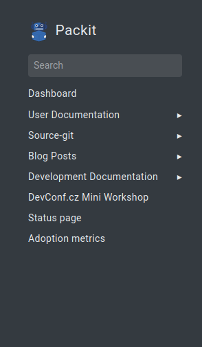

## Instrumenting

### Prometheus

(Docs available [here](https://github.com/prometheus/client_python))

We will reuse the
[`/metrics`](https://github.com/packit/packit-service/blob/main/packit_service/service/app.py#L52)
endpoint.

From what I understand, the new measured values will need to be added to
[Pushgateway](https://github.com/packit/packit-service/blob/main/packit_service/worker/monitoring.py#L29).
Then use/reuse the metrics definitions in the code ->
[how to](https://github.com/prometheus/client_python#instrumenting).
If needed, you can define your
[own collectors](https://github.com/prometheus/client_python#custom-collectors) but the basic
ones should be enough.

---

## Gathering data and displaying them into graphs

The data will be gathered from the `/metrics` endpoint.

To aggregate the data dynamically in real time, we will use
[promql queries](https://prometheus.io/docs/prometheus/latest/querying/basics/).

We have a few options here, each has some pros and cons which are described in each point.

### Grafana

Probably the easiest way to go since grafana provides out-of-the-box support for prometheus.
We have also some experience with duo prometheus && grafana, so it should be easier for someone
whom run into a problem with this (he/she can ask someone (=^ ◡ ^=)).

Also since we already have a grafana dashboard listening on `/metrics` endpoint, it should be
fairly easy to visualize gathered data - just creating a new panel and navigate in the GUI
to edit panel and providing a reasonable
[promql queries](https://prometheus.io/docs/prometheus/latest/querying/basics/).

[grafana docs](https://grafana.com/docs/grafana/next/getting-started/get-started-grafana-prometheus/)

Pros:

- out-of-the-box support
- the easiest solution
- nice fancy dynamic graphs
- creating / deleting / editing graphs is easy and well described in the
  [docs](https://grafana.com/docs/grafana/next/getting-started/get-started-grafana-prometheus/)
- these graphs should be dynamic (when we want to see graphs in a given period - we can
  dynamically change this period)

Cons:

- visibility: only internal folks will be able to see the graphs (since our current dashboard
  is visible only for internal people and I don't expect that we will create another but public
  dashboard for everyone just so they can see it)

And it seems like there is no option how to make our grafana dashboard public.
See [this thread](https://community.grafana.com/t/making-selected-dashboards-public/873)

#### But... :)

It seems like there is a way to share grafana dashboard (e.g. via packit.dev).

There are some [projects](https://grafana.com/blog/2019/05/16/worth-a-look-public-grafana-dashboards/)
that have made their dashboards public for a variety of uses. So we may decide to make our own
grafana dashboard and we can share our metrics via (periodic)
[snapshots](https://grafana.com/docs/grafana/latest/sharing/share-dashboard/#publish-a-snapshot) or
provide a [link](https://grafana.com/docs/grafana/latest/sharing/share-dashboard/#use-direct-link).

#### But²

And it seems like there is another way to share and [render](https://grafana.com/grafana/plugins/grafana-image-renderer/)
even panels from internal dashboard and show to users only relevant graphs (no requirement for
our own grafana dashboard).

It's also possible to share an [individual panel](https://grafana.com/docs/grafana/latest/sharing/share-panel/)
so we can share individual panels via packit dashboard (if possible) and render them there.
Also I didn't found a reason why we can't share our individual panels (to render it, packit dashboard
should have access to our internal grafana dashboard - but it is possible, isn't it?)
so it should be possible to share it on packit dashboard (and provide a link there in packit.dev menu)
with our internal grafana.

To render these panels we must install the [Grafana Image Renderer plugin](https://grafana.com/grafana/plugins/grafana-image-renderer/?tab=installation)

---

(These options below (dashboard and packit.dev) are pain in the ass - especially to safely gather
and display the data from prometheus. I do not recommend to choose them since I spent quite some
time to figure out how to do this but still a lot of implementation details are unknown to me)

### Only dashboard

Way harder to implement since we have to aggregate and dynamically display the data into
graphs by ourselves.

We can reuse the javascript code we have and just create a subpage (let's say
dashboard.packit.dev/adoption-metrics), gather the data and then display these metrics. I probably
got at least some answer to the question of how to export data and work with it in this
[article](https://blog.risingstack.com/node-js-performance-monitoring-with-prometheus/#nodemonitoringwithprometheus).
However, we still won't be able to get and view some fancy charts.

Once we (somehow) gather the data - it should be easy to display them via [charts](https://jscharting.com/examples/chart-types/).

Long story short: it will be easier just to implement the
[/graph](https://prometheus.io/docs/prometheus/latest/getting_started/#using-the-expression-browser)
endpoint which prometheus provides and view data there. But it has its limitations - it's not
possible to view some advanced fancy graphs which grafana may provide.

---

### Only packit.dev

The hardest option for implementation part (lot of evil javascript programming) since we have to
implement the javascript code from a scratch + the same things as described in the `Dashboard`
section above.

Pros:

- users can see the metric directly on our webpage

Cons:

- lot of extra work required
- lot of javascript coding ;)

---

### Provide link to Grafana/Dashboard on packit.dev menu

It is also possible to implement the first(/second) option (grafana/dashboard) and provide a link
to the page in packit.dev - so we will not reinvent the wheel, just provide a link via
packit.dev menu and pretend like it is also available on packit.dev.

The menu on packit.dev page may look like this:

And user can click on the `Adoption metrics` option, and be redirected to the grafana/dashboard
with the real implementation.

---

## Conclusion

Overall the simplest solution is the Grafana option. It will be quite challenging if we want to
make our dashboard publicly visible but it's still easier than gathering the data and displaying
them by ourselves (dashboard option).

The dashboard option requires gathering data and providing it as a graphs
which will lead to more time required to complete the implementation. The advantage is that these
graphs will be available to public out-of-the-box. However, as I provided above,
it's really challenging to provide the data on our packit dashboard.

The hardest solution is implementing it on packit.dev page - which I do not recommend.
We can implement the alternative (last) option instead and save some time.
