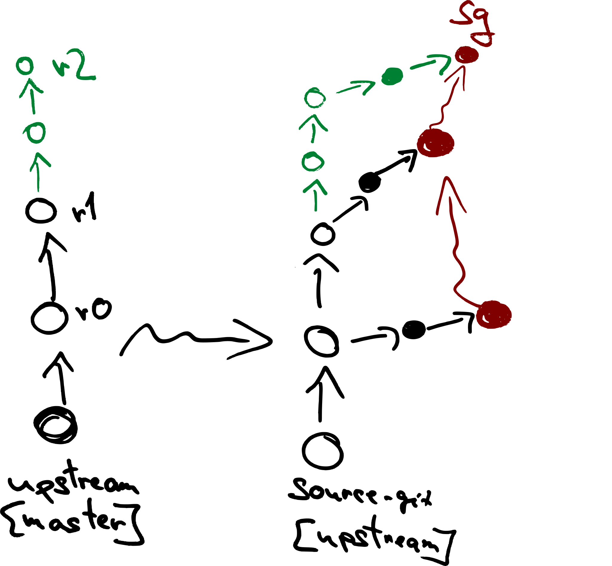
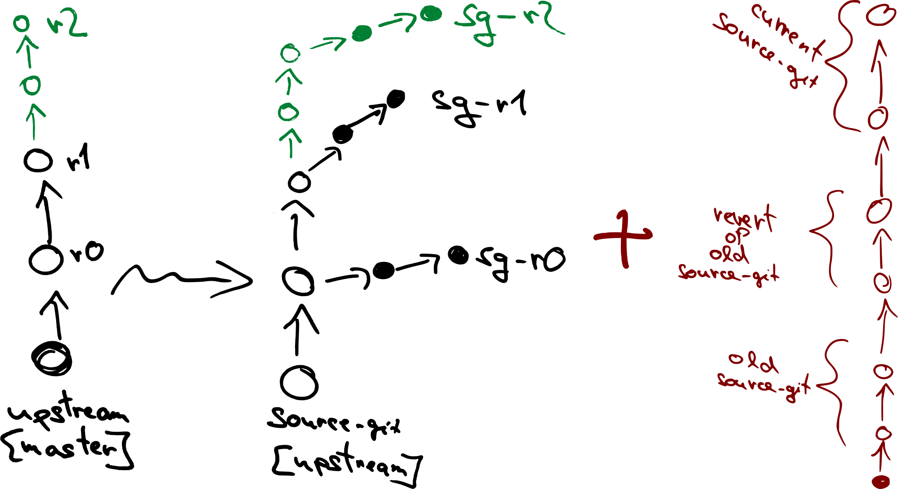

## How to do the rebase via source-git?

Generally, we need to provide the following tasks:

- [ ] The new change needs to be converted from upstream to source-git.
- [ ] The changed source-git can be converted to dist-git.
  - Via PR or a new Bugzilla.
  - (This text does not cover this.)

What changes can occur?

- Change in upstream means always change in the source-archive in distgit.
- Change in source-git can mean:
  - Change in distribution files => can be converted directly.
  - Change in the source code => new patch needs to be added.

### Solutions for upstream -> source-git from GIT perspective

#### 1. New branch for each release

- We have one branch (`upstream` in the following image) mapping the upstream releases.
- For each new upstream release, we will create a new source-git branch.


#### 2. Force-push

- For each new upstream release, we will regenerate source-git and force-push.



#### 3. Revert & Regenerate

- We can use same solution we discussed [updates from distgit](../dist-git-to-src-git/updates.md).


#### Combination of 1. and 2.

- Create a new source-git branch for a new release.
- Have one main source-git branch that will always point to the HEAD of the current source-git.
- Force-push needed.


#### Combination of 1. and 3.

- Create a new source-git branch for a new release.
- Have one main source-git branch that will always contain the current source-git.
  The updates will be done by reverting and recreating the new source-git on top of the old one.
  - Various options mentioned in [updates from distgit](../dist-git-to-src-git/updates.md).
- No force-push needed.



### To rebase or not to rebase?

It is a question if we want to do rebase or do the part of the source-git generation again.
How this can differ?

- Our generation algorithm can be improved.
- The default packit config can be improved.
- The non primary sources can change. (We add them in a form of commit on top of the upstream history.)

### How do we get known about a need for a rebase?

Various ideas about the trigger for rebasing follow. Combination of multiple approaches is possible.

#### 1 Manual update

- User decides when he wants to do the rebase.
- Implementation:
  - Using a packit CLI.
- Possible conflicts can be solved on a git level.

#### 2 Automation

It can be very convenient for users if we can trigger the update automatically,
without any manual intervention.
Various scenarios are described in the subsections.

When rebasing a new version, we can get a conflict that can't be solved automatically.
What can we do in that case? (Both options can be used together.)

- Ask user to do the process manually, via CLI.
- Open a merge request that can be updated manually.

##### 2.1 Upstream issue

- New issue in source-git with a title like `rebase from upstream`.

##### 2.2 Scheduled update

- No need to listen to any service.
- We can potentially use Upstream Release Monitoring.
- Like the current updates.

##### 2.3 Listen for upstream events

- We don't have access to upstream projects.
- Upstream will either need to install our GitHub application or be enabled on github2fedmsg.

##### 2.4 Listen for downstream events

- Update when the rebase is done in distgit.
- Does not make sense for projects using source-git as a way to do the rebase.
- This is more about syncing dist-git updates to source-git.

##### 2.5 Bug created

- The bug can be created by Upstream Release Monitoring or manually.
- Isn't this a misuse of Bugzilla's?

### How Python maintainers do source-git?

source: https://hackmd.io/9f64YNIZTCy0ZzKb5wKtqQ

Structure:

- Fedora patches stored in https://github.com/fedora-python/cpython
- In the repo, there are `fedora-X.Y` branches for python version`X.Y`.
- This branch is based on the upstream history (build on top of the upstream tag).
- On top of the upstream history, there are patches in form of git commits.
- There is a naming scheme for the patch commits.
- The git rebase is used for updating the branches. (There is a tag left for history purpose.)
- `git cherry-pick` used for rebasing downstream patch commits from a different branch.
- Fix-up commits are created when patch needs to be edited.
  (Interactive rebase is used when generating the dist-git patches.)
- Removal is done as a commit revert.

Converting commits to dist-git patches

- They use [importpatches script](https://github.com/fedora-python/importpatches).
  - Python script using `git format-patch --no-numbered` behind the scenes.
- Obsolete patches needs to be handled manually.

### How the rebase looks like for `chrony`?

We have a source-git repository for chrony containing the upstream history:
https://gitlab.com/packit-service/src/chrony/

The important branch is the `el8-with-upstream` containing the upstream history
with the downstream commits on top of it:

```
* 36f28c2f - Apply patch chrony-service-helper.patch (2 weeks ago) (el8-with-upstream) <Packit>
* 03fe724d - Add sources defined in the spec file (2 weeks ago) <Packit>
* 75055614 - Add spec-file for the distribution (2 weeks ago) <Packit>
* 6557d593 - .packit.yaml (2 weeks ago) <Packit>
* ffb9887c - doc: update NEWS (1 year, 7 months ago) (tag: 3.5) <Miroslav Lichvar>
* 9220c9b8 - update copyright years (1 year, 7 months ago) <Miroslav Lichvar>
* 2e28b191 - doc: add note about minsamples to FAQ (1 year, 7 months ago) <Miroslav Lichvar>
* 636a4e27 - refclock: remove unnecessary strlen() call (1 year, 7 months ago) <Miroslav Lichvar>
* 5c9e1e0b - test: extend 133-hwtimestamp test (1 year, 7 months ago) <Miroslav Lichvar>
* 64fd1b8b - ntp: check value returned by CMSG_FIRSTHDR (1 year, 7 months ago) <Miroslav Lichvar>
*
*
```

As you can see, there is one commit with packit config file, second one with specfile
and the other one contains all the other sources that are defined in the specfile.
Then, commits representing the downstream patches follow.

We can use basic git rebase to update our source-git.
[Here](https://gitlab.com/packit-service/src/chrony/-/network/el8-with-upstream)
you can see `rebase-for-master` and `rebase-for-3.5-stable` branches.

### Conclusion

- Probably the best way to do the updates is the manual way via CLI.
  - It allows user to solved the possible conflicts.
  - Easier to implement.
  - The automation can be added later.
- Scheduled updates can be useful for rawhide in a "automaintainer" usecase.
  - Can create a PR against SG.
- The _3. Revert & Regenerate_ can be used for the current source-git repositories (the dist-git ones).
- The _Combination of 1. and 2._ can be used if we are able to force-push,
  the _1. New branch for each release_ or _Combination of 1. and 3._ otherwise.
